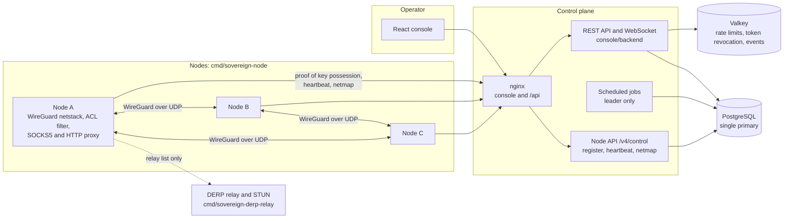
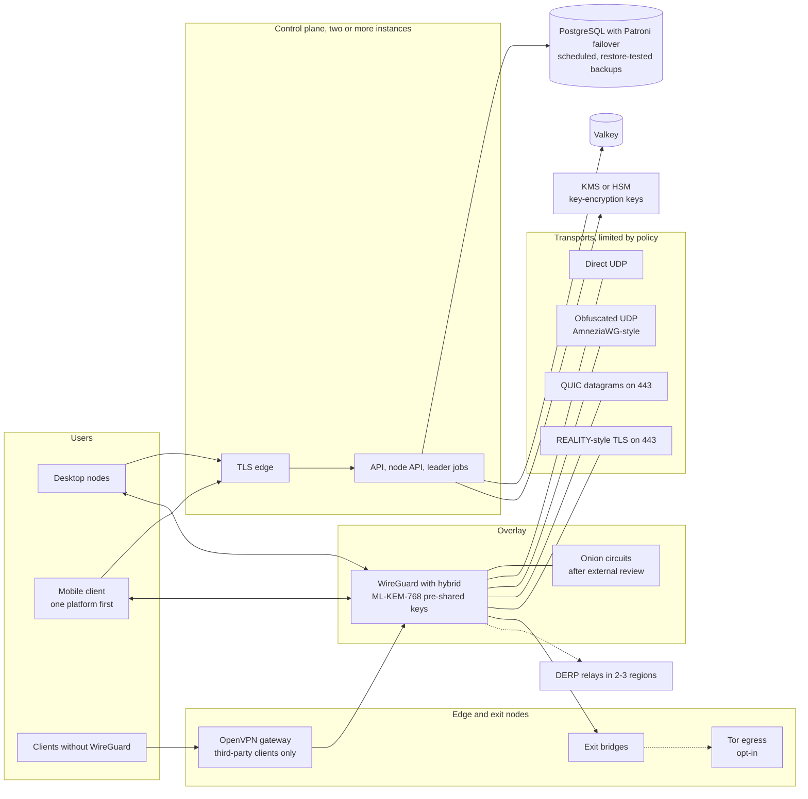

# NeroNet

> **Under active development.** NeroNet is not ready for production use. It has had no
> external security audit or penetration test. Read [Current state](#current-state) and
> [Security status](#security-status) before building on it.

NeroNet is an overlay mesh VPN with a web management console. It has two halves: Go
nodes (`cmd/sovereign-node`, `pkg/*`) and a Node.js control plane with a React console
(`console/backend`, `console/frontend`), backed by PostgreSQL and Valkey. The
development stack currently uses PostgreSQL 18 and Valkey 9.1; backend CI also runs
against PostgreSQL 16. The
target users are banks and public administration
([ADR 0006](docs/adr/0006-target-market-banks-and-public-administration.md)). The
licence is AGPL-3.0.

## Current state

The development fleet contains thirteen WireGuard nodes and two relay services.
The overlay matrix measures all 156 directed TCP exchanges between the thirteen
nodes. Passing that matrix does not certify host-installed clients, DERP failover
or production readiness. Check the exact commit's CI result before deploying.

Implemented behavior:

- **Data plane.** Each node runs WireGuard in userspace (`wireguard-go` with gVisor
  netstack) and filters every packet with the ACL policy it received. Peers, addresses,
  policy and relay list come from a versioned netmap that the control plane compiles.
  Peer changes are applied incrementally, so a netmap change does not drop existing
  sessions. Pre-shared keys between peers are derived from the node keys and rotated by
  epoch.
- **Control plane.** Nodes enrol, receive an overlay address from `100.64.0.0/10`, send
  a heartbeat every 15 seconds and fetch a new netmap when its version advances.
- **Revocation and quarantine.** A revoked or quarantined node is removed from every
  other node's peer set on their next heartbeat. Lifting a quarantine readmits it.
- **Fail-static, then fail-closed.** With the control plane unreachable, nodes keep the
  last netmap. Past the staleness bound the netmap carries, they drop every peer.
- **Node identity.** Registration requires proof of possession of the node's X25519
  key. After enrolment, which needs the fleet token or a single-use pre-auth key, each
  node authenticates with its own credential. A revoked key cannot register again.
- **Node proxies.** A node runs a local SOCKS5 and HTTP CONNECT proxy with optional
  authentication. It answers success only once the outbound connection is established,
  resolves names over DNS-over-HTTPS and refuses private address ranges.
- **Console sign-in.** Password with optional or mandatory TOTP
  (`SOVEREIGN_MFA_MANDATORY`), and OpenID Connect single sign-on (authorization code
  with PKCE, ID token verified). The access token lives in page memory; the refresh
  token only in an HttpOnly cookie.
- **Audit trail.** Every event is chained with an HMAC under a dedicated key, and
  checkpoints are signed with a pinned Ed25519 key.
- **Organisation secrets.** Identity-provider secrets, TOTP seeds and provider refresh
  tokens are sealed with a per-organisation data key, which an organisation shred
  destroys.
- **Several control plane instances.** A PostgreSQL advisory lock elects one leader,
  and scheduled jobs run on it only. This is not a complete HA deployment or proof
  that an old worker is fenced during a database failover.
- **TLS and recovery.** The console and node control API use HTTPS, with internal
  CA trust by default or optional ACME HTTP-01. Pebble issuance, served renewal and
  recovery have been exercised. The backup drill restores schema, data and backend
  keys on a disposable stack, then checks node identity/address continuity and TCP.
  A local REST copy does not demonstrate an offsite destination.
- **Mesh view and metrics.** The console includes a radial topology and native node
  counters. Policy links and device counters are not measurements of the transport
  used by each peer; authenticated per-peer path observations are a separate gate.
- **DERP relays and STUN** (`cmd/sovereign-derp-relay`). The stack starts two, and nodes
  receive the relay list in the netmap. The relayed path has not been measured.

Implemented and tested, but not used by any running node: onion cell sealing
(`pkg/routing`), AmneziaWG-style packet obfuscation (`pkg/dataplane/stealth`), NAT
traversal (`pkg/nat`, not run against real NATs) and the active-defence daemon
(`cmd/sovereign-security-daemon`).

Not implemented, though offered at some point: OpenVPN, VLESS/REALITY, ShadowTLS, Tor
exits, onion circuits, a post-quantum tunnel, mobile clients and release signing. They
are listed with their plans in [roadmap section 13](docs/ROADMAP.md#13-advertised-not-implemented).
[docs/HANDBOOK.md](docs/HANDBOOK.md) states the state of each part in more detail.

## Architecture

### Today



### Deployment choices

Start with a single control-plane host; a database cluster is optional. These are
deployment profiles of the same product, not different VPNs.

| Profile | Architecture | Delivery status |
|---|---|---|
| **Simple, without HA** | One host with HTTPS/console, API, one PostgreSQL and Valkey; independent encrypted backups | Current development stack. Guided VM installation and daily-use desktop client acceptance remain open. No Patroni or etcd required. |
| **Database HA** | Three PostgreSQL/Patroni instances and three etcd voters across independent failure domains; one writable primary | Planned. Protecting the database alone leaves single points of failure in the rest of the service. |
| **Full service HA** | Database HA plus multiple API/HTTPS instances, Valkey failover, fenced jobs and independent relay/gateway paths | Planned. Requires failure tests for each component and the complete service. |

The control plane distributes identity, peers and policy. It is not the central
router drawn in the radial view: WireGuard data travels between nodes. The target
transport design adds authenticated redundant DERP while retaining direct UDP as
the preferred path, within the transports allowed by policy.

The [deployment profiles](docs/en/deployment-profiles.md) describe both diagrams,
the three-VM/three-DC database proposal, migration and the checks required before
claiming HA. Neither a Patroni template nor several running API containers proves HA.

### Future building blocks

The diagram below is a target design, not a list of available features. Direct UDP
and the current control-plane components are included for context. Implementation
order and retained future ideas are in [Roadmap](#roadmap).



## Install and run with Podman

The stack and the tests run in containers. The scripts use Podman when it is installed
and Docker otherwise (`NERONET_ENGINE` overrides the choice). On Windows, run every
command from Git Bash.

1. **Install the tools.**
   - Linux: `podman` and a compose provider (`podman-compose` or `docker-compose`) from
     your distribution.
   - Windows and macOS: [Podman Desktop](https://podman-desktop.io/), which installs
     both. On Windows also install [Git for Windows](https://gitforwindows.org/).
   - Check: `podman compose version` must print a version.

2. **Windows and macOS only: start the Podman machine.** The following requests four
   CPUs and 8 GB for a development VM; it is not a measured production capacity.
   Reuse an existing machine rather than initializing it again.

   ```sh
   podman machine init --cpus 4 --memory 8192 --disk-size 60
   podman machine start
   ```

3. **Get the code.**

   ```sh
   git clone https://github.com/Mohamed-DN/neronet-proxy.git
   cd neronet-proxy
   ```

4. **Generate the secrets.** `gen-env.sh` writes `.env` with fresh random values and
   never overwrites an existing file. Keep a copy of `SOVEREIGN_SHRED_KEK_SECRET` outside
   the machine: without it, sealed organisation secrets cannot be read.

   ```sh
   sh scripts/dev/gen-env.sh
   ```

   An `.env` from an earlier version needs `SOVEREIGN_AUDIT_HMAC_SECRET` and
   `SOVEREIGN_SHRED_KEK_SECRET` added (each `openssl rand -hex 32`).

5. **Start the control plane.** Builds the images and waits until PostgreSQL, Valkey,
   the backend and the console are healthy.

   ```sh
   sh scripts/dev/stack.sh up
   ```

6. **Start the nodes.** Two DERP relays and thirteen nodes, which enrol and build the mesh.

   ```sh
   sh scripts/dev/stack.sh nodes
   sh scripts/dev/smoke.sh 13 240   # waits for thirteen nodes with a heartbeat, checks /api/health
   ```

7. **Sign in.** Open <https://127.0.0.1:8443> (TLS only; the certificate is signed by the
   development CA in `certs/ca.crt`, which you can import into the browser) and sign in
   as `admin` with the password
   `SOVEREIGN_ADMIN_PASS` from `.env`. With `SOVEREIGN_MFA_MANDATORY=admins` or `all`,
   the console asks you to set up an authenticator app first.

8. **Check the overlay.** `e2e.sh` starts a disposable stack (its own name, ports offset
   by 3000), measures real traffic between the thirteen nodes in five default
   scenarios (matrix, ACL deny, quarantine, control plane outage and revocation),
   then deletes that test project's containers and volumes. Use only a disposable
   project, never the name of an existing deployment. CI additionally checks native
   metrics, authenticated discovery and subnets.

   ```sh
   COMPOSE_PROJECT_NAME=neronet-e2e NERONET_PORT_OFFSET=3000 sh scripts/dev/e2e.sh
   ```

9. **Day to day.**

   ```sh
   sh scripts/dev/stack.sh status         # health and live node count
   sh scripts/dev/stack.sh logs backend   # last 200 lines of one service
   sh scripts/dev/stack.sh down           # remove this project's containers; keep data volumes
   ```

Ports in use: `NERONET_PORT_OFFSET=1000 sh scripts/dev/stack.sh up` moves all of them.
More in [DEVELOPER_SETUP.md](DEVELOPER_SETUP.md), sections 3 and 5.

The backend runs with `NODE_ENV=production`. It refuses to start without the secrets
that `gen-env.sh` writes, and refuses any value that has appeared in a committed file.

## Command line tool

Needs Go on the host. Load the environment first: `set -a && . ./.env && set +a`.

| Command | What it does |
|---|---|
| `status` | Counts the exit bridges the control plane lists. |
| `peers [COUNTRY]` | Lists exit bridges, filtered by country, with their score. |
| `circuit [COUNTRY]` | Asks the control plane for a three-hop path and prints it. No circuit is established. |
| `keygen` | Generates a Curve25519 keypair and a node id. |
| `stun-ping <host:port>` | Sends a STUN binding request and prints the mapped address and round trip. |

Example: `go run ./cmd/sovereign-cli peers DE --control-url http://127.0.0.1:8081` (the
API port on the loopback interface; the CLI has no option for the console's CA yet).

## Repository layout

| Path | Content |
|---|---|
| `cmd/sovereign-node` | The node: data plane, proxies, enrolment, heartbeat, netmap |
| `cmd/sovereign-cli` | The command line tool above |
| `cmd/sovereign-derp-relay` | DERP relay with a STUN server |
| `cmd/sovereign-control-plane` | The Go control plane. Not the control plane to run; scheduled for removal ([ADR 0007](docs/adr/0007-remove-go-control-plane-server.md)) |
| `cmd/sovereign-security-daemon` | Active-defence daemon (separate module, not deployed) |
| `pkg/` | Go packages; see the handbook, section 2.2 |
| `console/backend` | The control plane: REST API, WebSocket, `/v4/control` for nodes |
| `console/frontend` | The React console and its nginx |
| `docker-compose.yml`, `scripts/dev` | The development stack and the test scripts |
| `helm/neronet` | Helm chart for the control plane |
| `docs/` | Handbook, roadmap, decision records (`docs/adr`), archive |
| `charts/`, `k8s/`, `terraform/` | Deployment manifests. They have never been applied to a real cluster or account ([ADR 0012](docs/adr/0012-deployment-target-vm-first.md)) |

## Tests

```sh
sh scripts/dev/test-go.sh        # gofmt, go vet, go test -race
sh scripts/dev/test-backend.sh   # backend suite against a throw-away Valkey
sh scripts/dev/test-frontend.sh  # production build and unit tests
sh scripts/dev/e2e.sh            # thirteen nodes, real overlay traffic and policy scenarios
```

CI runs the same suites, the thirteen-node stack with the overlay scenarios, linters, image
builds, secret scanning over the full history, CodeQL and dependency audits
(`.github/workflows/ci.yml`, `security-scan.yml`).

## Security status

In place, and checked by tests or by the CI jobs:

- No secret in any committed file. The backend refuses to start in production on a
  missing secret or on a value that has ever been committed. `gitleaks` scans the full
  history in CI.
- The backend container runs as an unprivileged user with a read-only root filesystem,
  no Linux capabilities and `no-new-privileges`.
- Rate limits, shared across instances through Valkey, on every API route, with tighter
  limits on sign-in, registration, node enrolment and the endpoints that verify a
  secret.
- Tenant isolation through one ownership middleware, with a test that probes every
  node-addressed route as the wrong tenant. Risk, topology and WebSocket views are
  scoped to the caller's organisation.
- Node registration with proof of key possession, per-node credentials, and refusal of
  revoked keys.
- Tamper-evident audit chain with signed checkpoints.
- Federation requires a verified Ed25519 signature and a key fingerprint confirmed by
  the operator through another channel.

Known gaps:

- No external audit and no penetration test. `pkg/crypto` and `pkg/routing` have had no
  external review; a nonce-reuse defect was found and fixed in the onion layer in
  September 2026.
- Host-installed Windows/Linux clients, mobile tunnel providers and authenticated
  redundant DERP still need their end-to-end acceptance gates. Container traffic
  tests do not establish readiness on these platforms.
- The tunnel is classical X25519. The post-quantum pre-shared key is planned.
- Crypto-shredding covers organisation secrets only; other data is deleted, not
  encrypted. The key-encryption key is an environment secret, not a KMS or HSM.
- Audit events carry no organisation, so the ledger is readable in bulk by the platform
  super-admin only.
- The node does not measure disk encryption or firewall state, so every node's posture
  is unverified.
- PostgreSQL failover and complete service HA are not tested. Backup/restore has a
  real isolated drill; a genuinely external recovery copy remains to be demonstrated.
- Cloud PC is switched off by default (`SOVEREIGN_FEATURE_CLOUD_PC`) and cannot stream.

## Roadmap

Deliver gradually, with an installable single-node product before the optional HA
profile. Future work remains planned; the order below does not remove earlier ideas.

1. **Close the security and recovery foundation.** Current account authority,
   durable session revocation, MFA/audit checks, exact-commit CI, TLS and real
   external backup recovery. Some packages are implemented; the overall gate is open.
2. **Finish reliable connectivity.** One WireGuard session with direct UDP and
   authenticated upstream DERP, two relay candidates, policy enforcement, loss of a
   relay and return to direct connectivity. Show measured paths in the mesh view.
3. **Make the simple installation usable.** Guided VM/container setup and actual
   Windows/Linux client installation, reboot/roaming/DNS/routes, upgrade and rollback.
   Native Android and Apple clients follow with their own platform acceptance tests.
4. **Add optional modules.** Tor egress, then additional transports such as obfuscated
   UDP, QUIC and TLS. Tor is an opt-in TCP/DNS egress path with leak prevention; it
   does not host the control plane or provide generic UDP forwarding.
5. **Add the redundant profile.** PostgreSQL/Patroni/etcd first, followed by the API,
   HTTPS edge, Valkey, jobs, certificates, relay and gateway failure scenarios.

Keep the longer-term tracks: subnet and exit-gateway resilience, federation,
competitor parity, plugins, regulated builds, KMS/HSM, hybrid post-quantum keys,
reviewed onion circuits, large-fleet performance, cloud/workspace features and
additional deployment targets. OpenVPN, VLESS/REALITY and ShadowTLS remain separate
proposals, not currently usable VPN choices. Cryptographic and advanced network
features keep independent review and traffic gates.

[The engineering roadmap](docs/ROADMAP.md), [decision records](docs/adr/) and
[archived plans](docs/archive/) are retained. Older claims or dates in a design
document are not evidence that its feature is delivered.

## Documentation

- [Engineering handbook](docs/HANDBOOK.md): what the system is and does, verified against
  the code. Start here.
- [Roadmap](docs/ROADMAP.md): load ceilings, high availability, federation, competitor
  parity, post-quantum status, and the features that were offered and do not exist.
- [Decision records](docs/adr/): each architectural decision, with its context and
  consequences.
- [Developer setup](DEVELOPER_SETUP.md): environments, compose stack, tests, configuration.
- [Administrator guide](docs/en/admin-guide.md).
- [Deployment profiles](docs/en/deployment-profiles.md): simple installation,
  database HA and full service HA; current boundaries and future acceptance gates.
- [Backup and restore](docs/en/backup-restore.md) and
  [TLS certificates](docs/en/tls-certificates.md): implemented operational flows.
- [Earlier high availability design](docs/HA_ARCHITECTURE.md) and
  [console architecture](docs/CONSOLE_ARCHITECTURE.md): design documents; the handbook is
  authoritative where they differ.
- [Environment template](.env.example).
- [Contributing](CONTRIBUTING.md) and [security policy](SECURITY.md).
- [Archive](docs/archive/): plans and reports of earlier phases, not maintained.

## Licence

AGPL-3.0. See [LICENSE](LICENSE).
