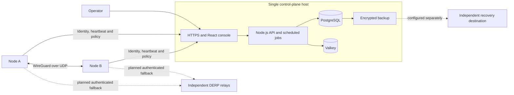
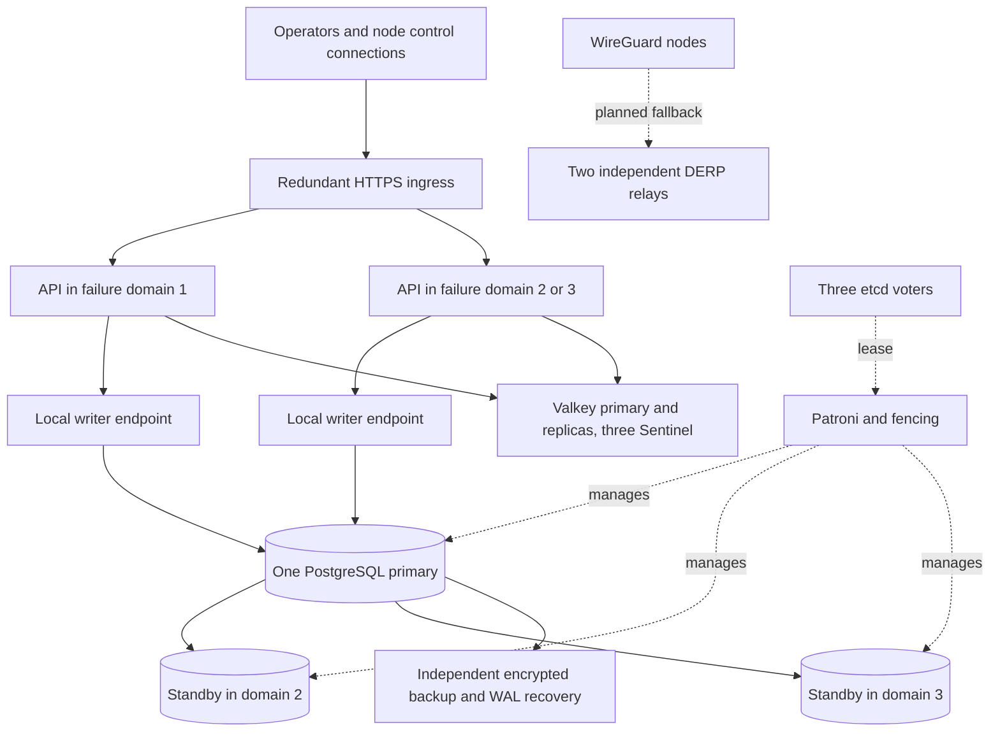

# Deployment profiles and architecture

NeroNet will offer a simple installation and an optional redundant installation.
The current Compose stack is a development implementation of the simple profile.
Guided provisioning, host client acceptance and HA failure tests are still open.
No HA topology in this document is a deployment command or a verified result.

## Simple installation: no HA cluster required

One VM or host runs HTTPS/console, the Node.js API, one PostgreSQL primary and
Valkey. Go nodes receive identities, peers and policy from this control plane;
their WireGuard data passes directly between peers. The radial console's centre
represents coordination, not an obligatory traffic hub.

This profile does not require Patroni, etcd or Kubernetes. Losing the host stops
control-plane operations. Existing nodes retain their last policy only until its
netmap expiry; this is not indefinite connectivity or immediate offline revocation.
Co-locating relays on that host also couples their availability to its failure.

The current backup drill exercises restore and real TCP on an isolated stack.
An external destination must be configured and independently recovered; a second
volume or REST server on the same machine does not establish offsite protection.
See [backup and restore](backup-restore.md) and [TLS certificates](tls-certificates.md).

## Database HA: planned advanced profile

The initial proposal uses three PostgreSQL/Patroni instances and three etcd voters,
spread across three independent failure domains. PostgreSQL has exactly one writer.
Two of the three etcd voters form a majority. Three VMs on one physical host do not
demonstrate survival of a host or data-centre failure.

Applications use a stable writer endpoint, for example a local HAProxy checking
Patroni `/primary` or `/read-write`. `/health` alone only establishes that PostgreSQL
is running, not that it is the current writer. See [Patroni's API](https://patroni.readthedocs.io/en/latest/rest_api.html).

Fencing must stop the old primary from writing before a replacement is accepted;
process termination alone does not cover a frozen host. Watchdog or equivalent
infrastructure fencing must be tested. See [Patroni watchdog support](https://patroni.readthedocs.io/en/latest/watchdog.html).

The proposed conservative mode uses synchronous replication and blocks critical
writes when a required synchronous replica is unavailable. Final settings need
latency, loss, storage and failure measurements. Three nearby DCs and three
continents have different trade-offs; no recovery time or zero-loss guarantee is
assigned here. See [etcd deployment considerations](https://etcd.io/docs/v3.6/faq/).

**Database HA alone is partial redundancy.** A single API, HTTPS ingress, cache or
gateway can still stop the service. The installer must identify remaining single
points of failure rather than label this profile full service HA.

## Full service HA: planned profile

| Component | Required design and acceptance |
|---|---|
| API and HTTPS | Multiple instances and a genuinely redundant entry point; login, enrolment and policy updates survive losing an instance with valid TLS. |
| Security authority | Durable revocations and current tenant/account state remain authoritative across API replicas and cache loss. A local fallback cache is not sufficient. |
| Valkey | Failover-aware clients, replicas and independent Sentinel voters; pub/sub reconnect and state reconciliation. Replication is not a durable authorization database. See [Valkey Sentinel](https://valkey.io/topics/sentinel/). |
| Scheduled jobs | Fence effects from an old leader, reconcile retries and use idempotent operations. A session advisory lock alone does not establish failover safety. |
| Database connections | Reconnect to the actual writer and handle ambiguous writes. A leader connection using a session advisory lock must not use transaction pooling. |
| CA and ACME | Coordinate issuance/renewal, protect keys, publish certificates atomically and verify reload during failure. |
| DERP and gateways | Independent candidates, real TCP during relay loss, and policy/netmap expiry respected. Gateway failover does not imply migration of existing TCP/NAT state. |
| Backup and monitoring | Restore outside the failed cluster, preserve identities and policy, measure recovery and report replication/quorum/expiry failures. Replicas do not replace backups. |

VRRP is only an option on compatible networks; it is not assumed to work between
arbitrary DCs. DNS failover has resolver caches and requires measured recovery.
The first target is VM deployment; Kubernetes and cloud manifests remain future
deployment tracks until applied and validated.

## Guided installation and migration

The future installer should ask for the profile, machines and failure domains,
check prerequisites, configure pinned versions and report what it actually tested.
It should support a simple host before requiring knowledge of Patroni or quorum.

Moving from single-node to HA is a migration: verified backup, new replicas and
quorum, fencing/writer checks, controlled cutover, then API/cache/edge redundancy.
Keep user identities, node IDs, overlay addresses and trust. After writes reach the
new writer, rollback requires reconciliation or recovery; it is not merely changing
an address. Shrinking a cluster, major database upgrades and disaster recovery have
separate procedures. A configuration switch alone does not perform these operations.

Acceptance must include primary loss, partitions, frozen old primary, quorum loss,
slow/full disks, API/cache/edge failures, certificate renewal and restore, with
actual login/enrolment/ACL/revocation and overlay traffic. Container tests do not
certify a three-DC installation. Targets for downtime and data loss are established
from the deployment's needs and then measured.

## Future work is retained

Neither HA nor Tor is required to bring up the first simple installation. Optional
Tor egress is a separate module: route selected TCP/DNS through a NeroNet gateway
and Tor public exits, with no silent direct fallback. Tor exits do not replace
NeroNet's API, database or DERP hosting. Native mobile integration needs its own
VPN-provider work; a portable Go binary alone does not establish a working app.

The [README roadmap](../../README.md#roadmap), [engineering roadmap](../ROADMAP.md),
[ADRs](../adr/) and [earlier plans](../archive/) remain available. Future transport,
mobile, federation, plugin, regulated-build, post-quantum and reviewed onion ideas
are deferred tracks, not deleted requirements or implemented claims.
